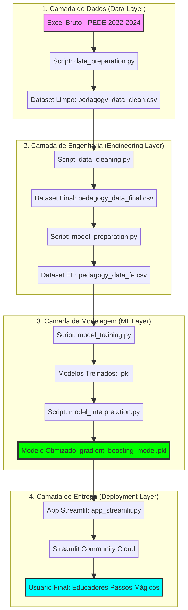

# Datathon Passos Mágicos - Prevenção de Risco Educacional

[](https://datathon-passos-magicos.streamlit.app)

## 📋 Sobre o Projeto

Este projeto foi desenvolvido para o **Datathon Passos Mágicos 2025** com o objetivo de criar um modelo preditivo de risco educacional para identificar alunos em situação de defasagem e fornecer insights estratégicos para intervenções pedagógicas personalizadas.

## 🎯 Objetivos

- Analisar dados educacionais de 2022 a 2024
- Responder a 11 perguntas de negócio estratégicas
- Desenvolver modelo preditivo de risco de defasagem (Machine Learning)
- Criar aplicação web interativa para uso pela equipe pedagógica
- Gerar insights acionáveis para maximizar o impacto do programa

## 🏗️ Estrutura do Projeto

```
datathon-passos-magicos/
├── data/
│   ├── raw/                    # Datasets brutos
│   └── processed/              # Dados processados
├── notebooks/
│   ├── Datathon_Passos_Magicos_Completo.ipynb  # Notebook consolidado
│   ├── FASE_1_Exploracao_Limpeza.md
│   └── FASE_2_EDA_Aprofundada_Insights.md
├── src/
│   ├── data_preparation.py     # Preparação de dados
│   ├── data_cleaning.py        # Limpeza de dados
│   ├── model_preparation.py    # Feature engineering
│   ├── model_training.py       # Treinamento de modelos
│   └── model_interpretation.py # Interpretação do modelo
├── app/
│   ├── app_streamlit.py        # Aplicação Streamlit
│   └── README.md
├── models/
│   ├── gradient_boosting_model.pkl  # Modelo treinado
│   └── scaler.pkl                   # Scaler para normalização
├── presentation/               # Apresentação final
├── requirements.txt            # Dependências Python
└── README.md                   # Este arquivo
```

## 📐 Arquitetura da Solução

A solução foi desenhada seguindo princípios de **Engenharia de Dados** e **MLOps**, garantindo que o fluxo desde o dado bruto até a predição final seja reprodutível e escalável.



### Pipeline de Dados e Deploy:
1.  **Camada de Ingestão**: Coleta automática de dados das abas do Excel (2022-2024).
2.  **Camada de Processamento**: Scripts Python automatizados para limpeza e padronização.
3.  **Engenharia de Atributos**: Criação de métricas complexas como a **Razão IDA/IEG** para aumentar o poder preditivo.
4.  **Treinamento**: Pipeline de ML comparativo com seleção automática do melhor modelo (Gradient Boosting).
5.  **Deploy**: Publicação via **Streamlit Community Cloud**, integrando o repositório GitHub diretamente com a interface web.

## 🚀 Como Executar Localmente

### Pré-requisitos

- Python 3.11+
- pip

### Instalação

```bash
# Clone o repositório
git clone https://github.com/gustmacena/datathon-passos-magicos.git
cd datathon-passos-magicos

# Instale as dependências
pip install -r requirements.txt

# Execute a aplicação Streamlit
streamlit run app/app_streamlit.py
```

A aplicação estará disponível em `http://localhost:8501`

## 📊 Principais Resultados

### Insights Estratégicos

1. **IAN (Adequação do Nível)**: Redução de 89% na taxa de alunos severamente defasados (4.66% → 0.56%)
2. **IDA (Desempenho Acadêmico)**: Queda de 4.7% em 2024 - requer atenção
3. **Engajamento (IEG)**: Correlação de 0.54 com IDA e 0.56 com IPV - fator crítico
4. **Autoavaliação (IAA)**: Correlação muito fraca (0.12-0.13) - desalinhamento com realidade

### Modelo Preditivo

- **Algoritmo**: Gradient Boosting Classifier (Otimizado)
- **ROC-AUC**: 0.72
- **Acurácia**: 70%
- **Recall**: 84% (identificação de alunos em risco)

**Top 3 Features Preditivas:**
1. Razão IDA/IEG (Desempenho vs Engajamento)
2. Ano (Tendência temporal)
3. Fase do Aluno

## 🎓 Recomendações Estratégicas

1. **Monitoramento Proativo**: Usar o modelo mensalmente para identificação precoce
2. **Aumento do Engajamento**: Implementar gamificação e atividades extracurriculares
3. **Feedback Estruturado**: Alinhar percepção do aluno com desempenho real
4. **Intervenções Personalizadas**: Focar em alunos com alta discrepância IDA/IEG
5. **Coleta de Dados Contínua**: Retreinar o modelo anualmente

## 🌐 Deploy no Streamlit Cloud

A aplicação está disponível online em: [https://datathon-ong-fiap.streamlit.app/](https://datathon-ong-fiap.streamlit.app/)

## 👥 Equipe

- **Gustavo Macena** - Data Analyst & Machine Learning Engineer
- **Equipe de Data Analytics**

## 📄 Licença

Este projeto foi desenvolvido para fins educacionais como parte do Datathon Passos Mágicos 2025.

## 🔗 Links Úteis

- [Associação Passos Mágicos](https://passosmagicos.org.br/)
- [Repositório GitHub](https://github.com/gustmacena/datathon-passos-magicos)
- [Aplicação Streamlit](https://datathon-ong-fiap.streamlit.app/)

---

**Desenvolvido com ❤️ para transformar vidas através da educação**
